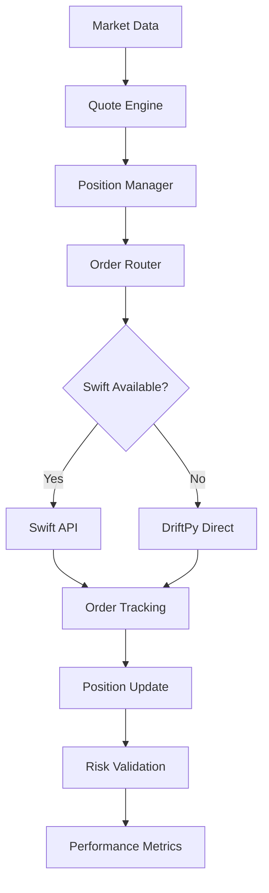
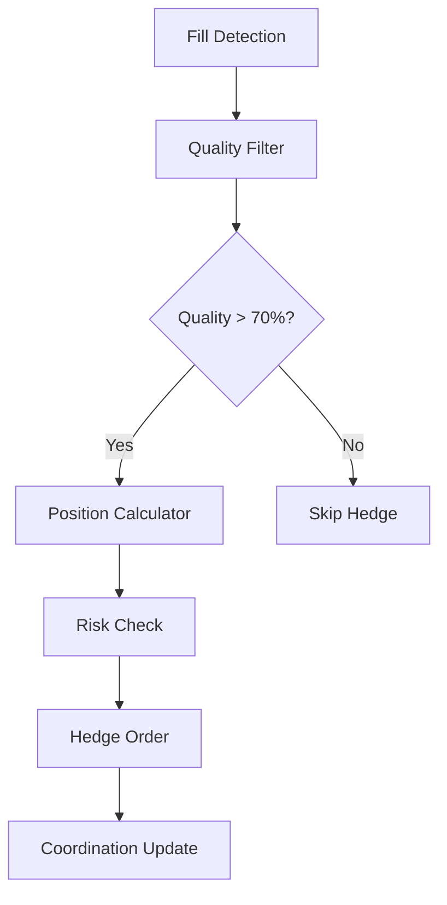
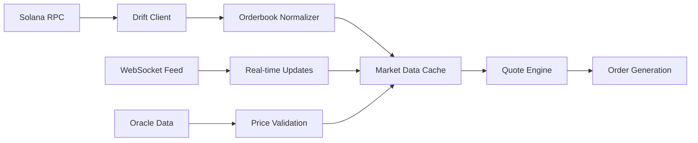
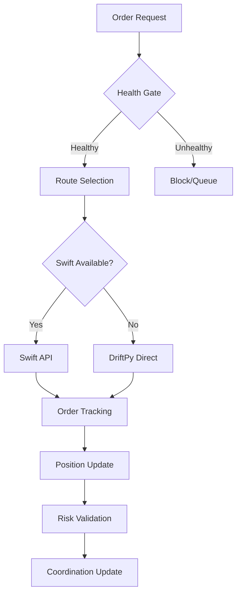
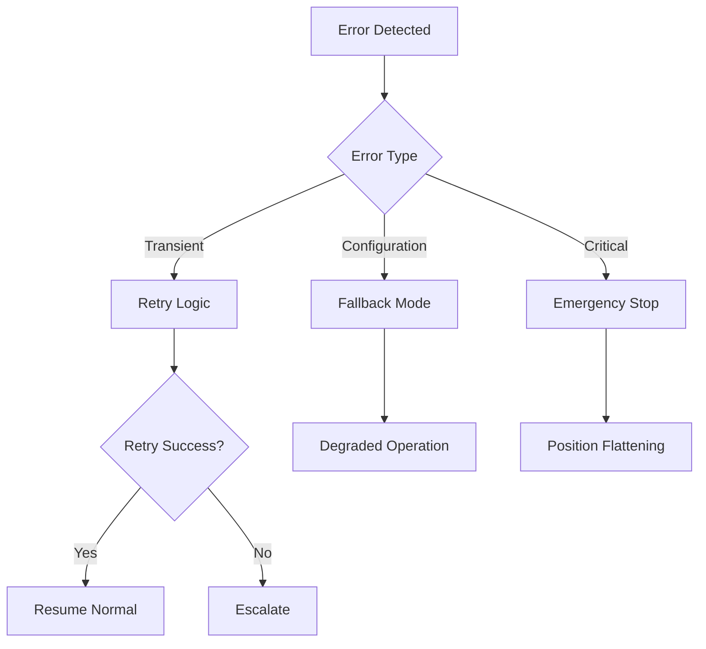

# 🏗️ **DRIFT SWIFT v1.0.0 ARCHITECTURE**

## **SYSTEM OVERVIEW**

Drift Swift v1.0.0 implements a **dual bot coordination architecture** designed for production-grade automated trading on the Drift Protocol. The system combines advanced market making with intelligent hedging through a sophisticated coordination layer.

---

## **🎯 CORE ARCHITECTURE PRINCIPLES**

### **1. Microservice Coordination**
- **Independent Bots**: Each bot can operate standalone
- **Shared State**: Coordinated position and risk management
- **Event-Driven**: Real-time communication between components
- **Graceful Degradation**: System continues operation if components fail

### **2. Multi-Layer Execution**
- **Swift API**: Primary execution path for low latency
- **DriftPy Direct**: Fallback execution when Swift unavailable  
- **Health Gates**: Automatic routing based on system health
- **Circuit Breakers**: Automatic recovery from transient failures

### **3. Production Reliability**
- **Resilient Subscriptions**: Auto-reconnect for all data feeds
- **Error Recovery**: Comprehensive error handling with retries
- **Health Monitoring**: Continuous system health validation
- **Fallback Systems**: Multiple execution pathways for reliability

---

## **🤖 BOT ARCHITECTURE**

### **Enhanced JIT Market Maker [MM]**



**Key Components:**
- **Quote Engine**: Dynamic spread calculation based on market conditions
- **Position Manager**: Inventory tracking and skew management
- **Order Router**: Smart routing between Swift and DriftPy
- **Risk Validation**: Real-time position and collateral checks

### **Quality First Hedger [H]**



**Key Components:**
- **Fill Detection**: Real-time monitoring of market maker fills
- **Quality Filter**: Machine learning quality assessment
- **Position Calculator**: Optimal hedge size determination
- **Risk Integration**: Unified risk management with market maker

---

## **🔄 COORDINATION ENGINE**

### **Cross-Bot Communication**

```python
class CoordinationEngine:
    def __init__(self):
        self.shared_state = SharedPositionState()
        self.event_bus = EventBus()
        self.risk_manager = UnifiedRiskManager()
    
    async def handle_fill(self, fill_event):
        # Update shared position state
        await self.shared_state.update_position(fill_event)
        
        # Notify all bots
        await self.event_bus.broadcast(fill_event)
        
        # Check risk limits
        await self.risk_manager.validate_positions()
```

### **Real-Time State Management**

| Component | Responsibility | Update Frequency |
|-----------|---------------|------------------|
| **Position Tracker** | Current inventory across all bots | Real-time |
| **Risk Calculator** | Unified risk metrics | Every tick |
| **Performance Monitor** | P&L and performance tracking | Every second |
| **Health Monitor** | System component health | Every 5 seconds |

---

## **📊 DATA FLOW ARCHITECTURE**

### **Market Data Pipeline**



### **Order Execution Pipeline**



### **Error Recovery Pipeline**



---

## **🛡️ RISK MANAGEMENT ARCHITECTURE**

### **Multi-Layer Risk Controls**

```python
class UnifiedRiskManager:
    def __init__(self):
        self.position_limits = PositionLimitManager()
        self.capital_allocator = CapitalAllocator()
        self.health_monitor = HealthMonitor()
        self.circuit_breaker = CircuitBreaker()
    
    async def validate_order(self, order):
        # Layer 1: Position limits
        if not await self.position_limits.check(order):
            return False
            
        # Layer 2: Capital allocation
        if not await self.capital_allocator.check(order):
            return False
            
        # Layer 3: System health
        if not await self.health_monitor.check():
            return False
            
        return True
```

### **Risk Hierarchy**

1. **Emergency Stops**: Immediate position flattening
2. **Position Limits**: Per-market exposure controls
3. **Capital Allocation**: Dynamic sizing based on available capital
4. **Health Gates**: Trading pause on system degradation
5. **Quality Filters**: Only high-quality trading opportunities

---

## **⚡ PERFORMANCE ARCHITECTURE**

### **Latency Optimization**

| Component | Target Latency | Optimization Strategy |
|-----------|----------------|---------------------|
| **Market Data** | <10ms | Cached orderbook, direct WebSocket |
| **Quote Generation** | <5ms | Pre-computed spreads, vectorized math |
| **Order Routing** | <20ms | Connection pooling, async I/O |
| **Swift Execution** | <50ms | Direct API, optimized payloads |
| **Position Update** | <10ms | In-memory state, batch updates |

### **Memory Management**

```python
class PerformanceOptimizer:
    def __init__(self):
        self.orderbook_cache = LRUCache(maxsize=1000)
        self.position_cache = {}
        self.metrics_buffer = CircularBuffer(10000)
    
    async def optimize_memory(self):
        # Periodic cleanup
        await self.cleanup_stale_orders()
        await self.compress_metrics()
        await self.gc_collect()
```

### **Throughput Scaling**

- **Async Processing**: All I/O operations are non-blocking
- **Connection Pooling**: Persistent connections to all endpoints
- **Batch Operations**: Group related operations for efficiency
- **Caching Strategy**: Intelligent caching of frequently accessed data

---

## **📈 MONITORING ARCHITECTURE**

### **Metrics Collection**

```python
from prometheus_client import Counter, Gauge, Histogram

# Core Metrics
orders_placed = Counter('orders_placed_total', 'Total orders placed', ['bot_type', 'side'])
positions = Gauge('current_position', 'Current position size', ['market'])
latency = Histogram('order_latency_seconds', 'Order placement latency')
health_status = Gauge('system_health', 'System health status', ['component'])
```

### **Health Monitoring**

| Metric | Type | Alert Threshold | Action |
|--------|------|----------------|--------|
| **Order Success Rate** | Percentage | <95% | Alert |
| **Position Drift** | Delta | >1% | Rebalance |
| **Latency** | Time | >100ms | Investigate |
| **Memory Usage** | Percentage | >80% | Scale |
| **Error Rate** | Count | >10/min | Pause |

### **Real-Time Dashboards**

- **Trading Overview**: Orders, fills, positions, P&L
- **System Health**: Component status, error rates, latencies  
- **Performance Metrics**: Throughput, success rates, efficiency
- **Risk Monitoring**: Position limits, collateral usage, VaR

---

## **🔧 CONFIGURATION ARCHITECTURE**

### **Hierarchical Configuration**

```yaml
# Environment Level (environments.yaml)
devnet:
  rpc_url: "https://api.devnet.solana.com"
  swift:
    base_url: "https://master.swift.drift.trade"
    
# Bot Level (live_trading_config.yaml)  
market_making:
  symbol: "SOL-PERP"
  buy_order_size: 0.5
  sell_order_size: 0.3
  
# Strategy Level (enhanced_params.yaml)
jit_strategy:
  latency_budget_enabled: true
  performance_tracking: true
```

### **Dynamic Configuration Updates**

- **Hot Reload**: Configuration changes without restart
- **Environment Switching**: Dynamic environment transitions
- **Feature Flags**: Enable/disable features in real-time
- **Parameter Tuning**: Live adjustment of trading parameters

---

## **🔒 SECURITY ARCHITECTURE**

### **Key Management**

```python
class SecureKeyManager:
    def __init__(self):
        self.keypair = self.load_encrypted_keypair()
        self.signer = Wallet(self.keypair)
        
    def load_encrypted_keypair(self):
        # Secure keypair loading with encryption
        path = os.environ.get('KEYPAIR_PATH')
        return Keypair.from_file(path)
```

### **Access Controls**

- **Environment Isolation**: Strict separation between dev/prod
- **API Authentication**: Secure authentication for all external APIs
- **Audit Logging**: Comprehensive logging of all trading actions
- **Error Sanitization**: Prevent sensitive data in error messages

---

## **🔄 DEPLOYMENT ARCHITECTURE**

### **Production Deployment**

```python
class ProductionDeployer:
    async def deploy(self):
        # 1. Environment validation
        await self.validate_environment()
        
        # 2. Dependency verification
        await self.check_dependencies()
        
        # 3. Configuration validation
        await self.validate_configs()
        
        # 4. Health checks
        await self.run_health_checks()
        
        # 5. Start orchestrator
        await self.start_orchestrator()
```

### **Orchestration Flow**

1. **Pre-flight Checks**: Validate all components
2. **Sequential Startup**: Start components in dependency order
3. **Health Validation**: Ensure all systems operational
4. **Traffic Routing**: Enable production traffic
5. **Monitoring**: Continuous health and performance monitoring

---

This architecture provides the foundation for a robust, scalable, and reliable automated trading system capable of operating in production environments with minimal human intervention.
